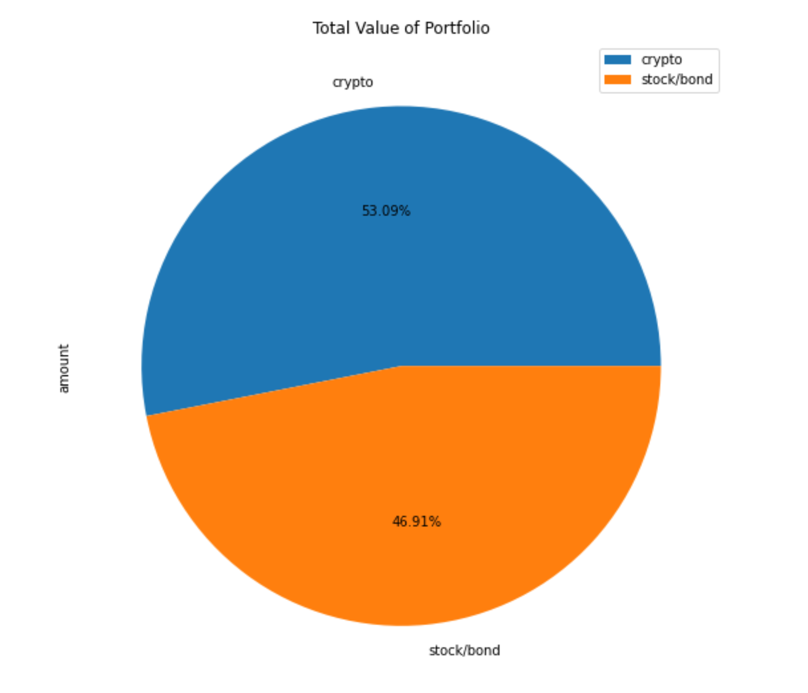
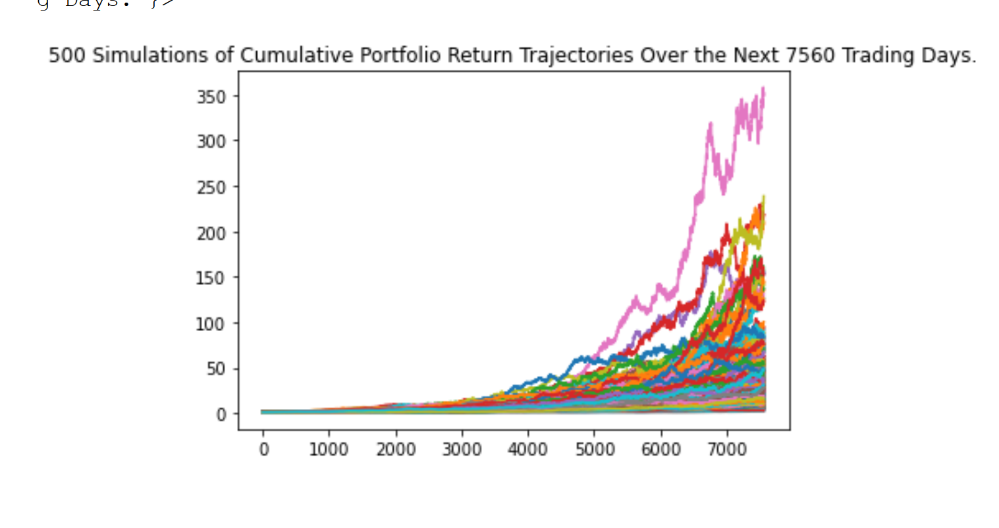
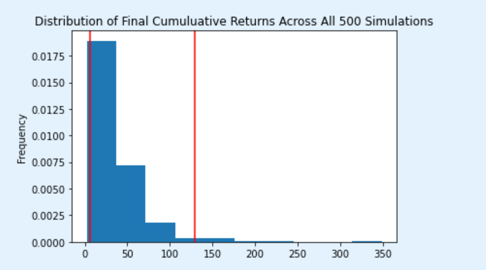
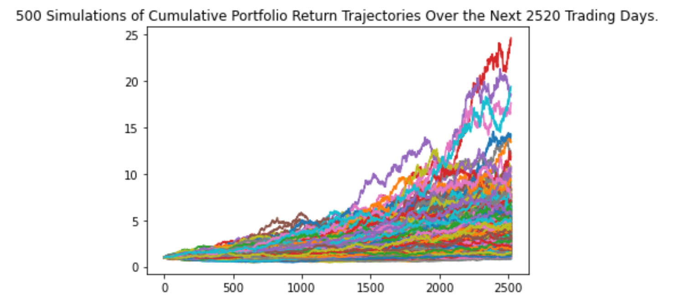
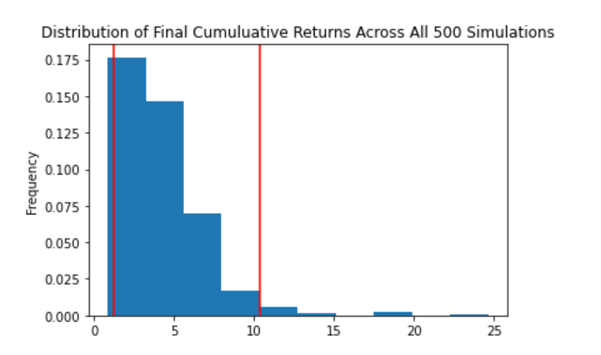

<div id="top"></div>
<br />

<h3 align="center">Financial Planner</h3>

  <p align="center">
  This financial planner is a tool for emergency funds and retirement planning. 
    <a href="https://github.com/jtengsico/05-Financial-Simulations-and-APIs.git">
  </p>
</div>

<!-- TABLE OF CONTENTS -->
<details>
  <summary>Table of Contents</summary>
  <ol>
    <li><a href="#built-with">Built With</a></li>
    <li><a href="#installation">Installation</a></li>
    <li><a href="#usage">Usage</a></li>
    <li><a href="#license">License</a></li>
    <li><a href="#acknowledgments">Acknowledgments</a></li>
  </ol>
</details>

<p align="right">(<a href="#top">back to top</a>)</p>

<!-- Built With -->
### Built With
* python 3.7 
* os
* requests
* json
* pandas 
* dotenv
* alpaca_trade_api 
* MCForecastTools 
* datetime 
* %matplotlib inline

<p align="right">(<a href="#top">back to top</a>)</p>

<!-- Installation -->
### Installation 

To setup this program on your desktop, please clone the repo.
Follow the steps below. 
1. Clone the repo
   ```sh
   git clone https://github.com/jtengsico/05-Financial-Simulations-and-APIs.git
   ```
2. Install required python packages listed in the Built With section. 
3. Navigate to the file in your terminal and launch it in jupyter notebook/lab. 

<p align="right">(<a href="#top">back to top</a>)</p>

<!-- Usage-->
### Usage

1. Value of Portfolio


2. MCForecast Simulation 1 
  

3. Simulation 1 Cumulative Returns


4. MCForecast Simulation 2


5. Simulation 2 Cumulative Returns 


<p align="right">(<a href="#top">back to top</a>)</p>

<!-- LICENSE -->
### License

Distributed under the MIT License.
See [license txt](https://github.com/git/git-scm.com/blob/main/MIT-LICENSE.txt)

<p align="right">(<a href="#top">back to top</a>)</p>

<!-- ACKNOWLEDGMENTS -->
### Acknowledgments
Credit to creator of readme template. The repo also has useful resources. 
* [README Template](https://github.com/othneildrew/Best-README-Template.git)

<p align="right">(<a href="#top">back to top</a>)</p>
